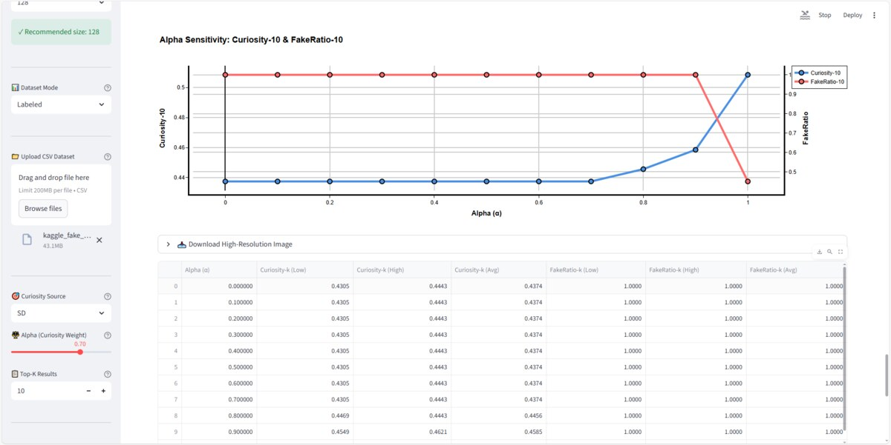
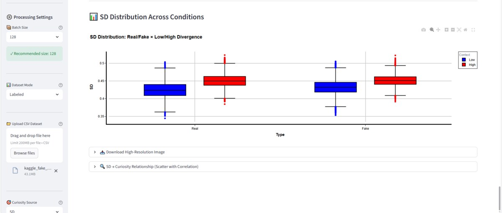

# Social Curiosity Recommender System

**An Empirical Evaluation of Social Curiosity–Driven Ranking for Financial Misinformation**

A master's thesis research prototype exploring how user interests, social-group context and article meaning influence news rankings.

**Python · Streamlit · pandas · NumPy · Sentence-BERT · scikit-learn · Plotly**

## Why this project matters

Popularity and similarity alone do not explain every useful recommendation. This project investigates a configurable alternative: ranking content using a semantic curiosity signal alongside popularity.

For content-platform and analytics teams, the prototype demonstrates how to inspect ranking trade-offs, compare social contexts and monitor the share of labeled fake articles in recommendations. These are potential applications—not measured improvements in revenue, engagement or misinformation prevention.

**This is a ranking experiment, not an automated fact-checker.** Real/fake information comes from supplied dataset labels.

## What the current application does

- Loads CSV articles and checks required columns.
- Encodes article text and user/group descriptions with `all-MiniLM-L6-v2`.
- Computes user–item, group–item and user–group cosine distances.
- Compares two configurable group contexts.
- Offers three curiosity sources: group–item distance, Semantic Divergence (SD), or a hybrid of both.
- Blends curiosity and popularity using an adjustable alpha parameter.
- Displays top-K results, sensitivity curves, SD distributions and labeled 2×2 comparisons.
- Calculates component-ablation metrics in labeled mode.
- Exports results and configuration metadata to CSV.


## See the output

These screenshots are taken from the thesis application's Streamlit views. They show the kinds of ranking comparisons and sensitivity analysis the app produces; they are illustrative research outputs, not a live hosted demo.





To try the workflow yourself, run the app locally and upload the included `synthetic_fake_news_demo.csv`. The small dataset is intentionally separate from the 44,898-article thesis evaluation.

## Method

The pipeline is data preparation, semantic embeddings, profile comparison, divergence scoring, ranking and visual evaluation.

```text
SD(u,G,i) = 0.3 × d(u,i) + 0.3 × d(G,i) + 0.4 × div(u,G)
Final(i) = alpha × Curiosity(i) + (1 − alpha) × Popularity(i)
```

Each distance uses `1 − cosine similarity`. The model embeddings are L2-normalized.

The application defaults to SD as its curiosity source and `alpha = 0.7`. Increasing alpha increases the weight on curiosity, not directly on credibility.

The current implementation combines the title with the first 200 characters of article text. Popularity uses the optional `prg` column; otherwise, it uses text length as a proxy. Text length is not an observed engagement measure.

## Thesis-reported evaluation

The January 2026 thesis describes an evaluation using **44,898 articles**, identified in the thesis as a Kaggle-hosted dataset originally sourced from Yahoo Finance. The full experimental dataset and run outputs are not included here; the following values are reported in the thesis, not independently reproduced from this repository.

| Experiment | Reported result |
|---|---|
| Real articles: low → high divergence | Average curiosity 0.4246 → 0.4503 |
| Fake articles: low → high divergence | Average curiosity 0.4326 → 0.4515 |
| Unlabeled context comparison | Approximately 5.2% higher average curiosity |
| Alpha sensitivity | Thesis identifies approximately 0.7–0.8 as a practical curiosity–popularity trade-off |

These are computed curiosity scores, not measured human engagement.

### Ablation findings and metric caveat

The thesis reports user–item, group–item and full-SD ranking scores of **0.8792**, **0.9212** and **0.9003**, respectively, under its NDCG@10 heading. Full SD therefore does **not** outperform every individual component.

The current `app.py` calls `ndcg_score` without a `k` argument, although the displayed column is named `NDCG-10`. It computes full-ranking NDCG rather than explicitly limiting evaluation to ten items. The thesis values should not be treated as verified NDCG@10 results until the original evaluation is reconciled.

The thesis also reports F1 = 0 in that ablation setting because the top-K selections contain only fake-labeled items when real items are defined as relevant. Curiosity-based ranking does not guarantee authenticity.

## Run locally

```bash
git clone https://github.com/bobby4525/rfake-news-recommender-system.git
cd rfake-news-recommender-system
pip install -r requirements.txt
streamlit run app.py
```

The first model load may require downloading Sentence-BERT weights.

Upload `synthetic_fake_news_demo.csv` in the sidebar to explore the small demonstration dataset. It is not the full thesis benchmark, and its outputs should not be expected to reproduce thesis results.

### Input columns

| Column | Use |
|---|---|
| `title` | Required article title |
| `text` | Required article content |
| `label` | Required in labeled mode: 0 = Real, 1 = Fake |
| `prg` | Optional numeric popularity score |

Choose the mode, upload the CSV, adjust the user/group profiles and alpha, inspect the results, and download the result CSV.

## Repository files

- `app.py`: Streamlit application and ranking/evaluation functions.
- `requirements.txt`: Python dependencies.
- `synthetic_fake_news_demo.csv`: Small synthetic demonstration dataset.
- `README.md`: Project overview and usage.

## Scope and limitations

- This repository is a demonstration implementation, not a complete reproduction package for the thesis.
- The thesis describes additional governance, GPT/template explanation, hashing and logging features; these are not all implemented in the current published app.
- Thesis-reported GPU throughput is not a verified benchmark of this code.
- Static text profiles and one research dataset limit generalization.
- Real/fake labels are supplied, not predicted or independently verified.
- Higher SD is a designed curiosity proxy; correlation with curiosity when curiosity equals SD is not independent behavioral validation.
- The ablation UI includes an unconditional “Full SD performs best” caption; actual calculated values should be compared instead.
- No production-readiness, fairness or business-impact claim is made.

Further work includes reproducible benchmark inputs and outputs, metric-label reconciliation, automated tests and human evaluation. These are future improvements, not current capabilities.

## Thesis and author

**Author:** Bobby Rana (雷銘)  
**Advisor:** Dr. Tzu-Lan Tseng (曾紫嵐博士)  
**Program:** Master's Program in Business and Management (English-Taught)  
**Department:** Department of Management Sciences  
**University:** Tamkang University (淡江大學)  
**Thesis date:** January 2026

**English title:** An Empirical Evaluation of Social Curiosity–Driven Ranking for Financial Misinformation  
**Chinese title:** 以社會好奇心驅動之財經假訊息排序的實證評估

### Citation

Rana, B. (2026). *An Empirical Evaluation of Social Curiosity–Driven Ranking for Financial Misinformation*. Master's thesis, Tamkang University.

## Responsible use

Use this prototype for research and demonstration. Do not rely on its rankings as the sole basis for financial, editorial or content-moderation decisions.
